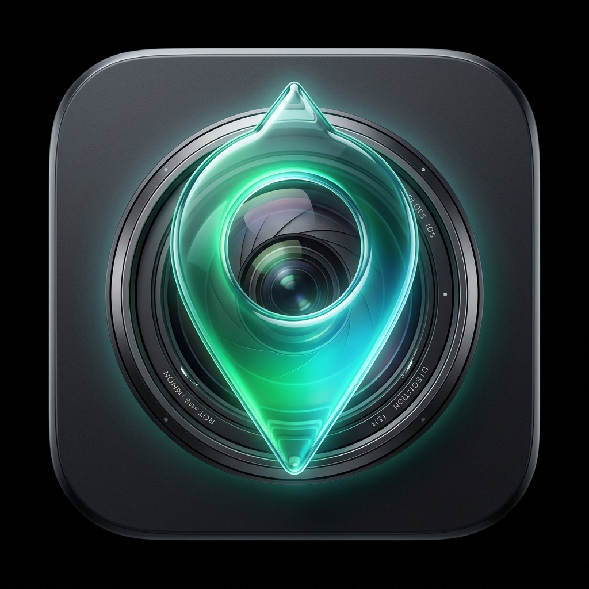

#  Pinmage — AI-Powered Photo Date & Location Injector

Pinmage is a native **macOS SwiftUI** utility that automatically restores historical metadata to your photo library. It leverages AI to extract dates and locations from scanned pages or photos, then embeds them natively.

---

## 🛠️ Key Features & How It Works

1. **AI Date & Location Extraction**: Scans images using Multimodal AI (Google Gemini or local Ollama models) to identify written dates, captions, notes, or landmarks, returning structured date and location metadata alongside AI confidence scores.
2. **Dual AI Provider Support**: Use **Google Gemini** (cloud API, pay-per-use) or **Ollama** (local, free, fully offline) — switch seamlessly in Settings with a refresh button to detect newly installed local models.
3. **Customizable Certainty Thresholds**: Filters AI output using a customizable threshold slider (defaulting to 80%). The app dynamically shows how many images will be updated and writes dates and GPS tags conditionally based on their individual confidence scores.
4. **Real-Time Cost Tracking**: Parses Gemini token usage metadata to compute real-time API spend in USD (Ollama is free) — stored persistently with support for resetting after confirmation.
5. **Chronological Interpolation**: Automatically sorts queue images alphabetically (essential for chronological matching of scanned album pages). If an image doesn't have an AI-identifiable date, it inherits the date of the previous photo.
6. **CoreLocation Geocoding**: Resolves text place-names (e.g., "Paris, France" or "Eiffel Tower") into precise latitude and longitude GPS coordinates.
7. **Local Caching**: Computes unique image hashes to cache analysis results, preventing redundant network requests.
8. **Concurrency Controls**: Allows configuring parallel requests limits to balance extraction speed and avoid API rate limits.
9. **Smart Downscaling**: Option to downscale large uploaded files to a maximum dimension of 1600px, reducing upload bandwidth usage by up to 98%.
10. **EXIF & GPS Injection**: Natively embeds metadata (`DateTimeOriginal` and GPS tags) into output copies (or overwrites originals) without requiring heavy external dependencies.

---

## 🚀 Installation & Build

You can compile and run Pinmage locally without using Xcode:

1. Clone the repository:
   ```bash
   git clone https://github.com/laresbernardo/pinmage.git
   cd pinmage
   ```
2. Run the build & install script:
   ```bash
   ./install.sh
   ```

This will automatically compile Swift sources, generate app icons, sign the app bundle, bypass Gatekeeper, install the app to `/Applications/Pinmage.app`, and package a shareable **`Pinmage.dmg`** in the project root.

---

## Ollama (Local AI) Setup

To use local AI models instead of the Gemini cloud API:

1. **Install Ollama** from [ollama.ai](https://ollama.ai)
2. **Pull a multimodal model** (required for image analysis):
   ```bash
   ollama pull llava
   # or: ollama pull bakllava, ollama pull moondream, etc.
   ```
3. **Keep Ollama running** in the background — Pinmage discovers it automatically at `http://localhost:11434`.
4. **In Pinmage Settings**, switch the *AI Provider* to **Ollama (Local)** and click **Refresh** to see your installed models.

> Only multimodal models (llava, bakllava, moondream) support image analysis. Ensure the model you pull is vision-capable.
